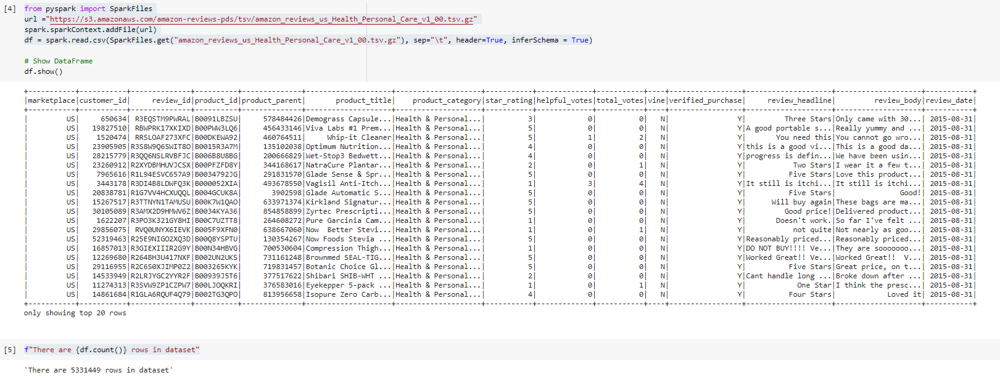
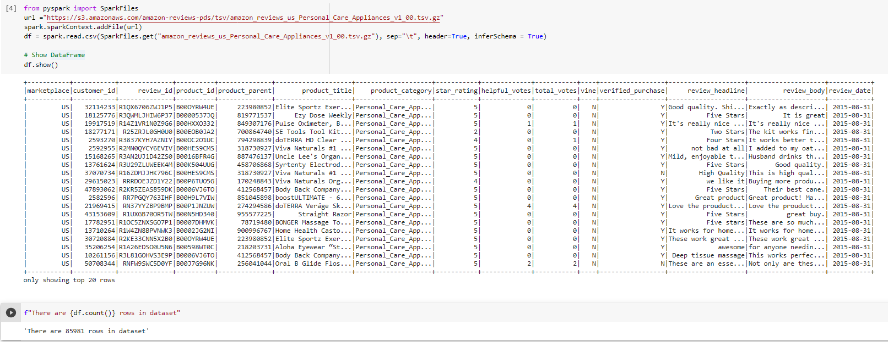
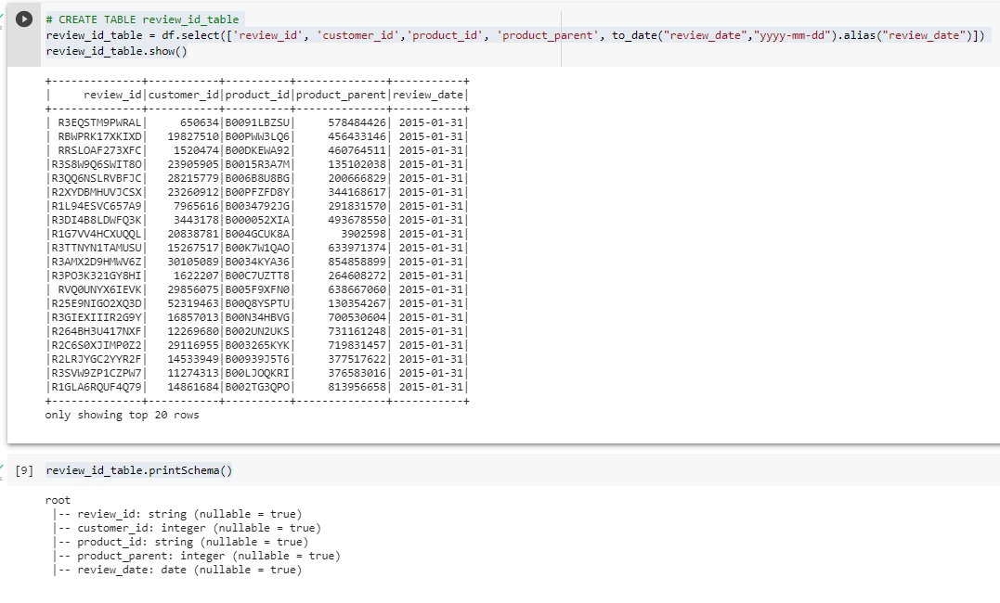
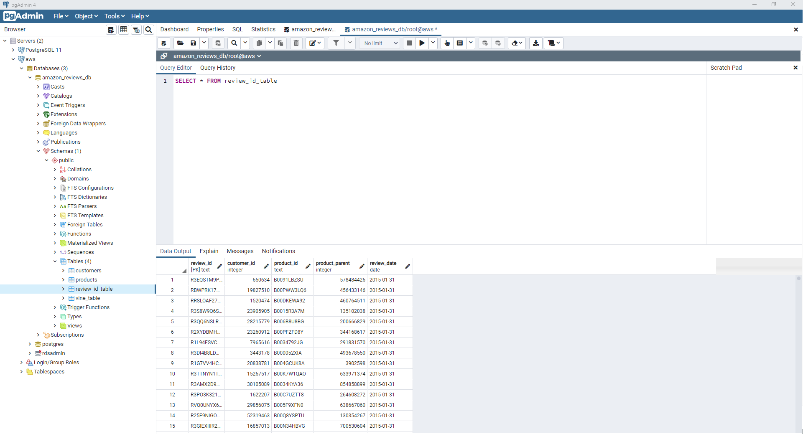

# big-data-challenge
Week 22 - Homework


## Background

In this assignment you will put your ETL skills to the test. Many of Amazon's shoppers depend on product reviews to make a purchase. Amazon makes these datasets publicly available. However, they are quite large and can exceed the capacity of local machines to handle. One dataset alone contains over 1.5 million rows; with over 40 datasets, this can be quite taxing on the average local computer. Your first goal for this assignment will be to perform the ETL process completely in the cloud and upload a DataFrame to an RDS instance. The second goal will be to use PySpark or SQL to perform a statistical analysis of selected data.

There are two levels to this homework assignment. The second level is optional but highly recommended.

1. Create DataFrames to match production-ready tables from two big Amazon customer review datasets.
2. Analyse whether reviews from Amazon's Vine program are trustworthy.


- - -

## Assignment structure
```
big-data-challenge
|__ .git                                                  # Gitignore file
|__ README.md                                             # Markdown README
|__
|  |__ Images/                                            # PNG files
|     |__ amazon-reviews.png                              # README png
|     |__ HealthPersonalCare_dataset_records.PNG          # Record Results png
|     |__ PersonalCareAppliances_dataset_records.PNG      # Record Results png
|     |__ pgAdmin.PNG                                     # Database create tables png
|     |__ pgAdmin_customers_table.PNG                     # Database customers tabl png
|     |__ pgAdmin_products_table.PNG                      # Database products table png
|     |__ pgAdmin_review_id_table.PNG                     # Database review_id table png
|     |__ pgAdmin_vine_table.PNG                          # Database vine table png
|     |__ pgAdmin2.PNG                                    # Database table png
|     |__ review_id_table_schema.PNG                      # Schema png
|__
|  |__ notebooks/                                         # Jupyter notebook files
|     |__ amazon_reviews_Health_Personal_Care.ipynb       # Health Personal Care notebook #1
|     |__ amazon_reviews_Personal_Care_Appliances.ipynb   # Personal Care Appliances notebook #2
|__
|  |__ resources/                                         # SQL Resource files
|     |__ query.sql                                       # Query file
|     |__ schema.sql                                      # Main Schema file
|     |__ vine_schema.sql                                 # Vine Schema file

```
- - -

## Usage

```
# -------------------------------------------
import os
# Find the latest version of spark 3.0  from http://www-us.apache.org/dist/spark/ and enter as the spark version
# For example:
# spark_version = 'spark-3.1.2'
spark_version = 'spark-3.1.2'
os.environ['SPARK_VERSION']=spark_version
# Install Spark and Java
!apt-get update
!apt-get install openjdk-11-jdk-headless -qq > /dev/null
!wget -q https://apache.mirror.digitalpacific.com.au/spark/spark-3.1.2/spark-3.1.2-bin-hadoop3.2.tgz
!tar xf $SPARK_VERSION-bin-hadoop3.2.tgz
!pip install -q findspark
# Set Environment Variables
os.environ["JAVA_HOME"] = "/usr/lib/jvm/java-11-openjdk-amd64"
os.environ["SPARK_HOME"] = f"/content/{spark_version}-bin-hadoop3.2"
# Start a SparkSession
import findspark
findspark.init()

# -------------------------------------------
!wget https://jdbc.postgresql.org/download/postgresql-42.2.9.jar

# -------------------------------------------
# Start Spark session
from pyspark.sql import SparkSession
spark = SparkSession.builder.appName("BigData-HW-1").config("spark.driver.extraClassPath","/content/postgresql-42.2.9.jar").getOrCreate()

# -------------------------------------------
from pyspark import SparkFiles
url ="https://s3.amazonaws.com/amazon-reviews-pds/tsv/amazon_reviews_us_Health_Personal_Care_v1_00.tsv.gz"
spark.sparkContext.addFile(url)
df = spark.read.csv(SparkFiles.get("amazon_reviews_us_Health_Personal_Care_v1_00.tsv.gz"), sep="\t", header=True, inferSchema = True)

# -------------------------------------------
from pyspark.sql.functions import to_date

# -------------------------------------------
# Configuration for RDS instance
mode="append"
jdbc_url = "jdbc:postgresql://<insert endpoint>:5432/my_data_class_db"
config = {"user":"root",
          "password": "<insert password>",
          "driver":"org.postgresql.Driver"}

```
- - -

## Resources

* [customer review datasets](https://s3.amazonaws.com/amazon-reviews-pds/tsv/index.txt)

- - -

## Datasets 

|No|Source|Link|
|-|-|-|
|1|Amazon Reviews Health Personal Care|https://s3.amazonaws.com/amazon-reviews-pds/tsv/amazon_reviews_us_Health_Personal_Care_v1_00.tsv.gz|
|2|Amazon Reviews Personal Care Appliances|https://s3.amazonaws.com/amazon-reviews-pds/tsv/amazon_reviews_us_Personal_Care_Appliances_v1_00.tsv.gz|

- - -

## Task


### Extract

* Use the furnished schema to create tables in your RDS database.

* Two separate Jupyter Notebooks have been created and are availble in the [notebooks](https://github.com/alysnow/big-data-challenge/tree/main/notebooks) folder where the data for Amazon Reviews Health Personal Care and Personal Care Appliances has been **extracted** from the list at [review dataset](https://s3.amazonaws.com/amazon-reviews-pds/tsv/index.txt) into each notebook.

* Each dataset has the following number of records (rows) in the dataset.

#### Amazon Reviews Health Personal Care



#### Amazon Reviews Personal Care Appliances




### Transform

* **Transform** the dataset to fit the tables in the [schema file](https://github.com/alysnow/big-data-challenge/blob/main/resources/schema.sql). Below is an example of the review_id_table schema to show DataFrame matches the data type and column name.




### Load

* **Load** the DataFrames that correspond to tables into an RDS instance. **Note:** This process can take up to 10 minutes for each. Be sure that everything is correct before uploading.

Below is a screenshot of the **amazon_reviews_db** in pgAdmin with a view of the review_id_table after taking 26 minutes to load from the google colab notebook to the corresponding table into the RDS instance using the following code "review_id_table.write.jdbc(url=jdbc_url, table='review_id_table', mode=mode, properties=config)" to write the DataFrame to the review_id_table in RDS



All remaining tables snippets within the **amazon_reviews_db** are availble in the [images](https://github.com/alysnow/big-data-challenge/blob/main/images) folder.

- - -

## Contributor
- [Alysha Snowden](https://github.com/alysnow)
